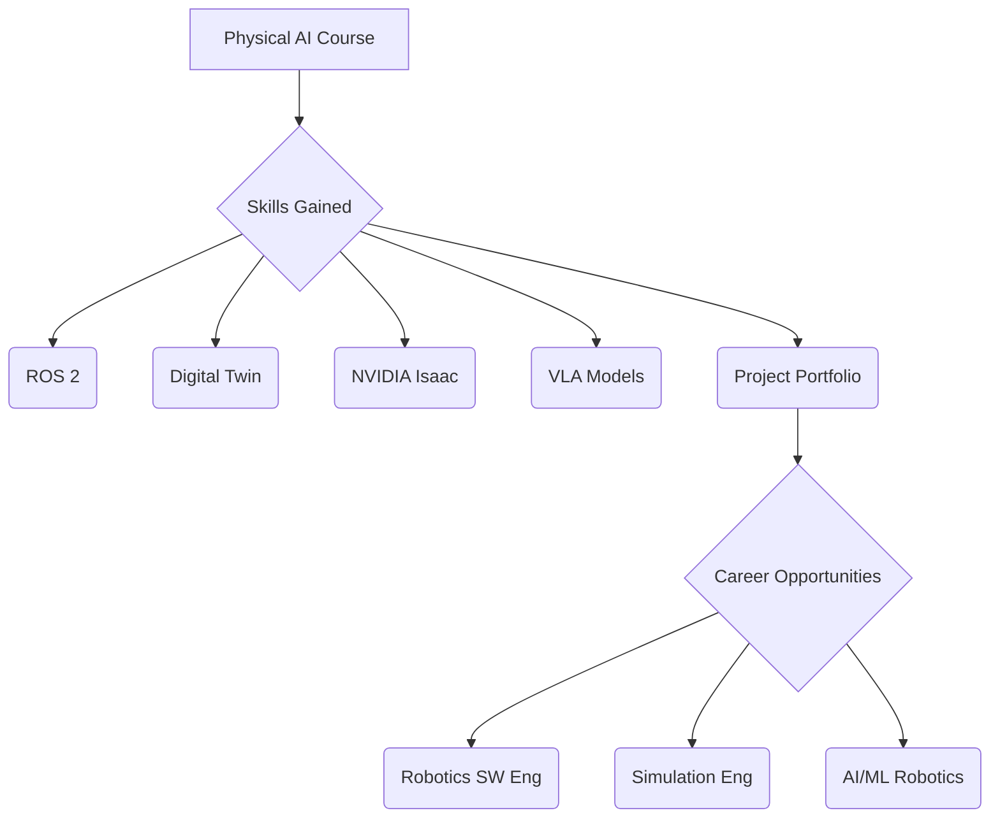

# Learning Outcomes

## Introduction
This chapter outlines the specific learning outcomes you can expect from the Physical AI course. We will detail the practical skills you will acquire, explore potential career opportunities in this burgeoning field, and guide you on building a robust project portfolio to showcase your expertise.

## Learning Objectives
- List the key skills gained upon course completion.
- Identify various career paths available in Physical AI.
- Understand the importance of a project portfolio and how to build one.

## Main Content

### Skills you'll gain
Upon successful completion of this course, you will be proficient in:
- **ROS 2 Development:** Designing, implementing, and debugging robotic applications using ROS 2.
- **Digital Twin Creation:** Building high-fidelity physics simulations with Gazebo and realistic rendering environments with Unity.
- **Sensor Integration & Simulation:** Working with virtual sensors like LiDAR, depth cameras, and IMUs.
- **NVIDIA Isaac Platform:** Utilizing Isaac Sim for simulation, Isaac ROS for accelerated perception, and Nav2 for robot navigation.
- **Vision-Language Models:** Implementing voice-to-action systems and cognitive planning with large language models for robotics.
- **Humanoid Robotics:** Understanding URDF for complex robot models and advanced control strategies.

### Career opportunities
The skills acquired in this course open doors to exciting roles, including:
- **Robotics Software Engineer:** Developing control systems, perception algorithms, and robot APIs.
- **Simulation Engineer:** Creating and managing virtual environments for testing and training AI models.
- **AI/ML Engineer (Robotics):** Designing and deploying machine learning models for robotic perception, decision-making, and control.
- **Autonomous Systems Engineer:** Working on self-driving cars, drones, and other autonomous agents.
- **Research Scientist:** Contributing to cutting-edge advancements in embodied AI and human-robot interaction.

### Project portfolio
Building a strong project portfolio is crucial for demonstrating your capabilities. Throughout this course, you will have opportunities to:
- Complete lab exercises that build foundational skills.
- Develop mini-projects integrating ROS 2, Gazebo, and Isaac Sim.
- Work on a significant Capstone Project, applying all learned concepts to a complex problem.
- Document your projects with clear explanations, code, and demonstrations.

## Code Examples
```python
# No code examples for this chapter.
```

## Diagrams


## Exercises
1. Envision a Physical AI project you'd like to include in your portfolio after this course.
2. Research a job opening in Physical AI and identify three skills from this chapter that are required.

## Key Takeaways
- The course provides hands-on skills in key Physical AI technologies.
- Graduates will be prepared for diverse roles in robotics, AI, and autonomous systems.
- A strong project portfolio, built throughout the course, is vital for career advancement.

## Next Steps
- Consider starting with the next module: [Module 1: ROS 2 - The Robotic Nervous System](../module-1-ros2/introduction.md)

## References
- [IEEE Robotics and Automation Society](https://www.ieee-ras.org/)
- [Association for the Advancement of Artificial Intelligence (AAAI)](https://www.aaai.org/)
