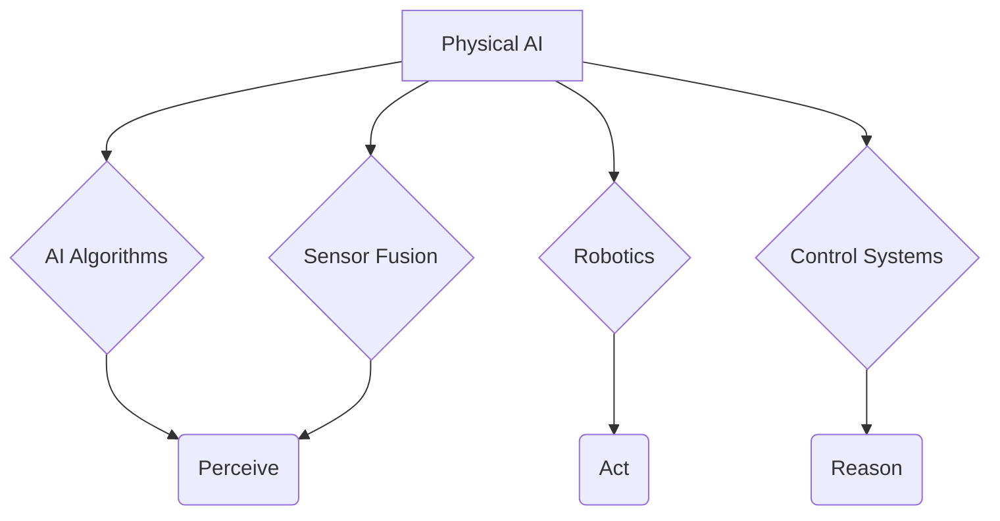

# Course Overview

## Introduction
This chapter provides a comprehensive introduction to the Physical AI course. We will explore the fundamental concepts of Physical AI, understand the course objectives, and outline the necessary prerequisites for a successful learning journey.

## Learning Objectives
- Understand the definition and scope of Physical AI.
- Identify the key learning objectives for this course.
- Review the prerequisites required to excel in this program.

## Main Content

### What is Physical AI
Physical AI refers to artificial intelligence systems that interact with the real world through physical bodies, such as robots. It combines AI algorithms with robotics, control systems, and sensor fusion to enable intelligent physical agents to perceive, reason, and act in dynamic environments.

### Course Objectives
Our main objectives for this course include:
- Developing a strong foundation in ROS 2 for robotic control.
- Mastering the creation of digital twins using Gazebo and Unity.
- Implementing AI-robotics solutions with NVIDIA Isaac Sim and Isaac ROS.
- Exploring vision-language-action models for advanced robotic capabilities.
- Building a project portfolio demonstrating practical Physical AI skills.

### Prerequisites
To get the most out of this course, we recommend the following:
- **Programming Skills:** Intermediate proficiency in Python and basic understanding of C++.
- **Mathematics:** Familiarity with linear algebra, calculus, and probability.
- **Robotics Basics:** Conceptual understanding of robot kinematics, dynamics, and control.
- **Machine Learning:** Basic knowledge of machine learning concepts and frameworks (e.g., PyTorch, TensorFlow).

## Code Examples
```python
# No code examples for this introductory section.
```

## Diagrams


## Exercises
1. Research a real-world application of Physical AI and describe its impact.
2. List three skills you expect to gain from this course.

## Key Takeaways
- Physical AI integrates AI with robotics for real-world interaction.
- This course focuses on practical skills in ROS 2, digital twins, and NVIDIA Isaac.
- Strong programming, math, and ML fundamentals are essential prerequisites.

## Next Steps
- [Why Physical AI Matters](why-physical-ai.md)

## References
- [What is Physical AI?](https://www.robotics.org/)
