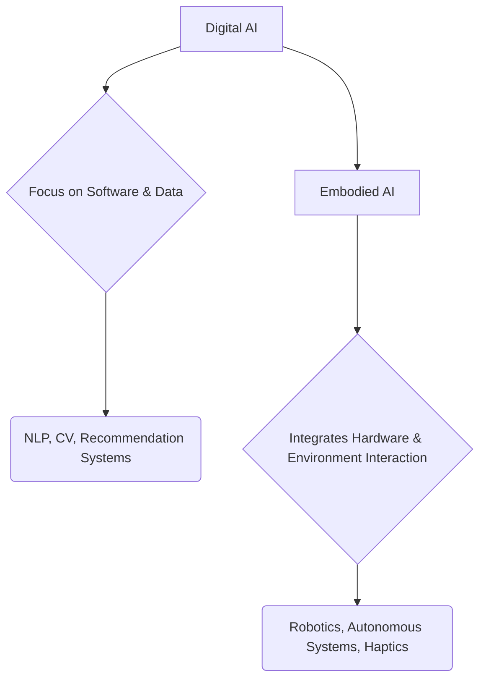

# Why Physical AI Matters

## Introduction
This chapter delves into the increasing importance of Physical AI, tracing its evolution from purely digital intelligence to embodied AI. We will examine critical real-world applications and survey the current industry landscape to understand the profound impact Physical AI is having.

## Learning Objectives
- Understand the transition from digital to embodied AI.
- Identify key real-world applications of Physical AI.
- Analyze the current industry trends and future outlook for Physical AI.

## Main Content

### Evolution from digital to embodied AI
The field of AI has seen tremendous progress in digital domains, from natural language processing to computer vision. However, for AI to truly interact with and impact the physical world, it needs embodiment. Embodied AI refers to intelligent agents that possess a physical body and can sense, act, and learn within a physical environment. This evolution is critical for tasks requiring manipulation, locomotion, and interaction in unstructured settings.

### Real-world applications
Physical AI is transforming various sectors:
- **Autonomous Vehicles:** Self-driving cars and drones navigate and perceive their surroundings.
- **Robotics in Manufacturing:** Collaborative robots (cobots) work alongside humans, performing precise and repetitive tasks.
- **Healthcare:** Surgical robots, prosthetic limbs, and assistive robots improve patient care and quality of life.
- **Logistics and Warehousing:** Autonomous mobile robots (AMRs) automate inventory management and material handling.
- **Exploration:** Drones and rovers explore dangerous or inaccessible environments, from deep sea to outer space.

### Industry landscape
The Physical AI industry is rapidly expanding, with significant investments in robotics, AI hardware, and integrated software platforms. Key players include established robotics companies, AI research institutions, and tech giants developing comprehensive AI-robotics ecosystems. The demand for skilled professionals in this interdisciplinary field is growing, creating numerous career opportunities.

## Code Examples
```python
# No specific code examples for this conceptual chapter.
```

## Diagrams


## Exercises
1. Name three industries where Physical AI is currently making a significant impact.
2. Discuss the main differences between purely digital AI and embodied AI, providing an example for each.

## Key Takeaways
- Embodied AI enables intelligent agents to interact physically with the real world.
- Physical AI has diverse applications in transportation, manufacturing, healthcare, and more.
- The industry is growing, driven by technological advancements and increasing demand for automation.

## Next Steps
- [Learning Outcomes](learning-outcomes.md)

## References
- [Robotics and AI: A New Era](https://www.ieee.org/)
- [The Rise of Embodied AI](https://openai.com/)
